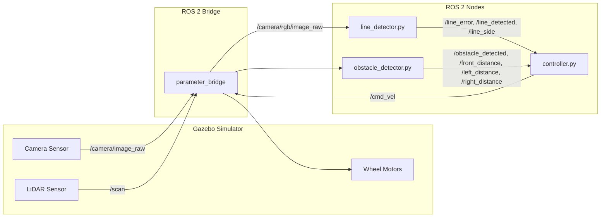
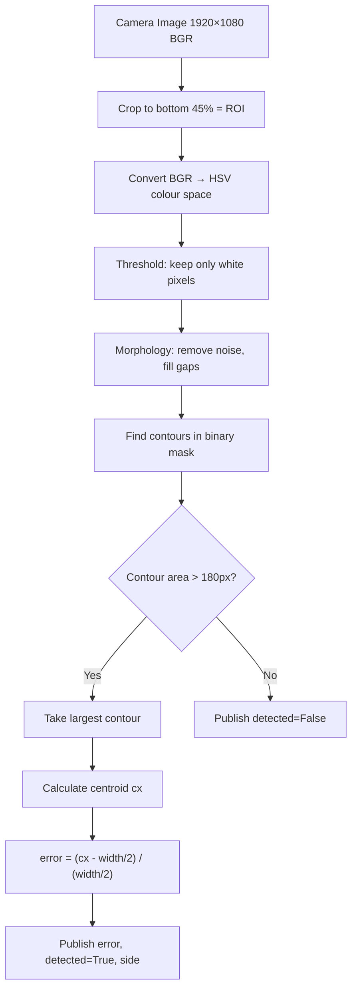
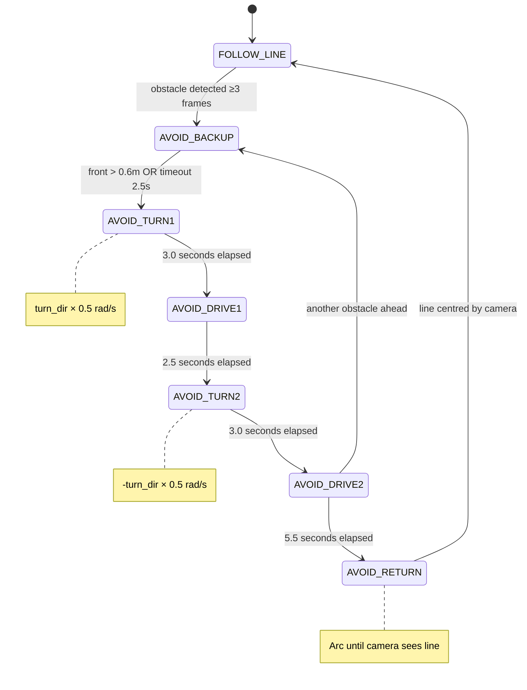

# Line Tracking & Obstacle Avoidance Robot — Complete Exam Guide

> **Project**: Autonomous line-following robot with obstacle avoidance  
> **Platform**: ROS 2 Jazzy + Gazebo Harmonic + TurtleBot3 Waffle  
> **Language**: Python 3.12  
> **Location**: `~/ros2_ws/src/line_tracking_avoidance/`

---

## Table of Contents

1. [Project Overview & Architecture](#1-project-overview--architecture)
2. [Technology Stack — Why Each Tool?](#2-technology-stack--why-each-tool)
3. [File Structure](#3-file-structure)
4. [File 1: `worlds/line_track.sdf` — The Simulation World](#4-file-1-worldsline_tracksdf--the-simulation-world)
5. [File 2: `line_detector.py` — Camera-Based Line Detection](#5-file-2-line_detectorpy--camera-based-line-detection)
6. [File 3: `obstacle_detector.py` — LiDAR-Based Obstacle Detection](#6-file-3-obstacle_detectorpy--lidar-based-obstacle-detection)
7. [File 4: `controller.py` — The Brain (PD + State Machine)](#7-file-4-controllerpy--the-brain-pd--state-machine)
8. [File 5: `launch/line_tracking.launch.py` — Launch Orchestration](#8-file-5-launchline_trackinglaunchpy--launch-orchestration)
9. [File 6: `package.xml` — Package Manifest](#9-file-6-packagexml--package-manifest)
10. [File 7: `setup.py` & `setup.cfg` — Build Configuration](#10-file-7-setuppy--setupcfg--build-configuration)
11. [ROS 2 Topic Communication Map](#11-ros-2-topic-communication-map)
12. [PD Control Theory — The Math](#12-pd-control-theory--the-math)
13. [Obstacle Avoidance State Machine — Deep Dive](#13-obstacle-avoidance-state-machine--deep-dive)
14. [Design Decisions & Trade-offs](#14-design-decisions--trade-offs)
15. [Potential Exam Questions & Answers](#15-potential-exam-questions--answers)

---

## 1. Project Overview & Architecture

### What does this project do?

A **TurtleBot3 Waffle** robot drives along a white line painted on a grey floor inside a Gazebo simulation. When it encounters a red box obstacle blocking the line, it autonomously navigates around it and rejoins the line on the other side.

### How does it work? (3-sentence summary)

1. The **camera** looks at the ground and uses computer vision (OpenCV) to find the white line and measure how far off-centre the robot is.
2. A **PD controller** uses that error to steer the robot so it stays centred on the line.
3. When the **LiDAR** detects an obstacle ahead, a **7-state machine** takes over and guides the robot through a rectangular detour around the obstacle, then hands control back to the PD line follower.

### System Architecture Diagram



**Key insight**: The camera is ONLY used for line tracking. The LiDAR is ONLY used for obstacle detection. This **separation of concerns** makes the system robust — the LiDAR works regardless of lighting, and the camera works regardless of obstacle material.

---

## 2. Technology Stack — Why Each Tool?

| Tool | Version | What it does | Why this tool? |
|------|---------|-------------|----------------|
| **ROS 2** | Jazzy | Robotics middleware — handles communication between nodes via topics | Industry standard for robotics. Provides pub/sub messaging, parameter management, launch system, and timing. |
| **Gazebo** | Harmonic | Physics simulator — renders the world, simulates sensors and robot physics | Accurate physics (friction, inertia), built-in sensor simulation (camera, LiDAR), and tight ROS 2 integration. |
| **Python** | 3.12 | Programming language for all 3 nodes | Rapid prototyping, excellent ROS 2 support via `rclpy`, easy OpenCV integration. |
| **OpenCV** | 4.x | Computer vision library for line detection | Industry standard for image processing. Provides HSV conversion, morphology, contour detection — everything we need. |
| **cv_bridge** | — | Converts between ROS Image messages and OpenCV numpy arrays | Without this, you'd have to manually decode raw image bytes. cv_bridge handles all format conversions. |
| **NumPy** | — | Numerical computing for LiDAR data processing | Processes arrays of 360 laser readings efficiently. `np.min()`, `np.where()`, masking operations are vectorised and fast. |
| **TurtleBot3 Waffle** | — | The simulated robot model | Standard educational robot with differential drive, 360° LiDAR, and RGB camera. Pre-built Gazebo model available. |
| **rmw_cyclonedds** | — | DDS middleware implementation | More reliable than default FastDDS for Gazebo bridge communication. Prevents dropped messages. |

### Why ROS 2 and not just a simple Python script?

ROS 2 provides three critical things:
1. **Pub/Sub messaging**: Nodes don't need to know about each other. The camera node just publishes data; whoever subscribes gets it.
2. **Parameter system**: You can change `Kp`, `base_speed`, etc. without editing code — just change the launch file.
3. **Simulation time**: `use_sim_time: True` synchronises all nodes to Gazebo's clock, so the robot behaves the same regardless of your computer's speed.

---

## 3. File Structure

```
line_tracking_avoidance/
├── launch/
│   └── line_tracking.launch.py    ← Starts everything (Gazebo + all nodes)
├── line_tracking_avoidance/       ← Python package (same name = ROS 2 convention)
│   ├── __init__.py                ← Empty file marking this as a Python package
│   ├── controller.py              ← THE BRAIN: PD control + obstacle avoidance
│   ├── line_detector.py           ← Camera → line position
│   └── obstacle_detector.py       ← LiDAR → obstacle distances
├── worlds/
│   └── line_track.sdf             ← Gazebo world definition (ground, line, obstacles)
├── resource/
│   └── line_tracking_avoidance    ← Empty marker file (ament convention)
├── test/                          ← Unit test stubs (not used in this project)
├── package.xml                    ← ROS 2 package manifest (dependencies)
├── setup.py                       ← Python install configuration
└── setup.cfg                      ← Install paths for executables
```

---

## 4. File 1: `worlds/line_track.sdf` — The Simulation World

**Purpose**: Defines what the Gazebo simulator renders — the ground, the line, and the obstacles.

**Format**: SDF (Simulation Description Format) — an XML-based format used by Gazebo.

### Line-by-line explanation

```xml
<sdf version="1.9">
  <world name="line_track_world">
```

> [!IMPORTANT]
> The world name `"line_track_world"` MUST match the name used in the spawn command in the launch file. If these don't match, the robot won't spawn.

#### Plugins (Lines 4-9)

```xml
<plugin filename="gz-sim-physics-system" name="gz::sim::systems::Physics"/>
<plugin filename="gz-sim-sensors-system" name="gz::sim::systems::Sensors">
  <render_engine>ogre2</render_engine>
</plugin>
<plugin filename="gz-sim-scene-broadcaster-system" name="gz::sim::systems::SceneBroadcaster"/>
<plugin filename="gz-sim-user-commands-system" name="gz::sim::systems::UserCommands"/>
```

| Plugin | What it does |
|--------|-------------|
| **Physics** | Simulates gravity, collisions, friction, wheel dynamics |
| **Sensors** | Renders camera images and generates LiDAR scans. Uses `ogre2` (GPU-accelerated renderer) |
| **SceneBroadcaster** | Sends visual data to the Gazebo GUI so you can see the simulation |
| **UserCommands** | Allows spawning/deleting models at runtime (needed for robot spawn) |

#### Lighting (Lines 11-17)

```xml
<light type="directional" name="sun">
  <cast_shadows>true</cast_shadows>
  <pose>0 0 10 0 0 0</pose>
  <diffuse>0.8 0.8 0.8 1</diffuse>
```

A directional sun light positioned 10m above the ground. This illuminates the scene so the camera can see the white line clearly. Without this light, the camera would see a black image.

#### Ground Plane (Lines 19-30)

```xml
<model name="ground_plane">
  <static>true</static>
  ...
  <material>
    <ambient>0.3 0.3 0.3 1</ambient>
    <diffuse>0.3 0.3 0.3 1</diffuse>
  </material>
```

- **40m × 40m** flat plane
- **Color**: RGB(0.3, 0.3, 0.3) = **dark grey**
- `<static>true</static>` means it doesn't move (no physics simulation needed)
- Has both `<visual>` (what you see) and `<collision>` (what the physics engine uses for contact)

**Why grey?** The white line needs contrast against the ground. Grey provides high contrast for the HSV thresholding in the line detector.

#### White Line (Lines 32-44)

```xml
<model name="white_line">
  <static>true</static>
  <pose>3.0 0 0.001 0 0 0</pose>
  <geometry><box><size>16.0 0.15 0.001</size></box></geometry>
  <material><diffuse>1 1 1 1</diffuse></material>
```

- **Dimensions**: 16m long × 0.15m wide × 0.001m thick
- **Position**: Centred at x=3.0, lying along the X-axis, raised 0.001m above ground (to prevent z-fighting — visual glitching when two surfaces overlap)
- **Color**: Pure white RGB(1,1,1)
- The line extends from x=-5 to x=11 (16m total)

#### Obstacles (Lines 46-74)

```xml
<!-- Obstacle 1 -->
<pose>2.5 0 0.15 0 0 0</pose>
<geometry><box><size>0.2 0.18 0.3</size></box></geometry>
<material><diffuse>1 0 0 1</diffuse></material>   <!-- Red -->

<!-- Obstacle 2 -->
<pose>6.0 0 0.15 0 0 0</pose>
<material><diffuse>1 0.5 0 1</diffuse></material>  <!-- Orange -->
```

| Property | Obstacle 1 | Obstacle 2 |
|----------|-----------|-----------|
| Position | x=2.5, y=0, z=0.15 | x=6.0, y=0, z=0.15 |
| Size | 0.2m × 0.18m × 0.3m | Same |
| Color | Red | Orange |

Both sit directly on the white line (y=0), blocking the robot's path. They're tall enough (0.3m) to be detected by the LiDAR (which sits ~0.17m high on the TurtleBot3).

---

## 5. File 2: `line_detector.py` — Camera-Based Line Detection

**Purpose**: Takes raw camera images, finds the white line, and publishes:
- How far off-centre the line is (normalised error)
- Whether a line is detected at all
- Which side of the image the line is on

### How it works — Step by step



### Code walkthrough

#### Imports and initialisation (Lines 1-34)

```python
from cv_bridge import CvBridge       # Converts ROS Image ↔ OpenCV array
```

**CvBridge** is essential. ROS 2 sends images as `sensor_msgs/msg/Image` (a flat byte buffer with metadata). OpenCV needs NumPy arrays. CvBridge handles this conversion.

```python
self.declare_parameter('roi_top_ratio', 0.55)
self.declare_parameter('min_area', 180)
```

**Parameters** (configurable from alnch file):
- `roi_top_ratio = 0.55`: Only look at the **bottom 45%** of the image. Why? The top half shows sky/walls — we only care about the ground directly ahead.
- `min_area = 180`: Ignore contours smaller than 180 pixels. This filters out noise (dust, shadows, reflections).

```python
self.lower_white = np.array([0,   0, 200])
self.upper_white = np.array([180, 40, 255])
```

**HSV thresholds for white detection**:
- H (Hue): 0-180 → accept ANY hue (white has no specific hue)
- S (Saturation): 0-40 → only LOW saturation (white is unsaturated; coloured objects have high saturation)
- V (Value/brightness): 200-255 → only BRIGHT pixels

**Why HSV instead of RGB?** In RGB, "white" depends on lighting — a shadow makes white look grey. In HSV, we can isolate brightness (V) independently of colour (H), making detection more robust to lighting changes.

#### Publishers (Lines 26-29)

```python
self.pub_error    = self.create_publisher(Float32, '/line_error',     10)
self.pub_detected = self.create_publisher(Bool,    '/line_detected',  10)
self.pub_side     = self.create_publisher(String,  '/line_side',      10)
self.pub_debug    = self.create_publisher(Image,   '/line_debug_img', 10)
```

| Topic | Type | What it publishes |
|-------|------|-------------------|
| `/line_error` | Float32 | Normalised error [-1.0, +1.0]. Negative = line is left, positive = line is right. 0 = centred. |
| `/line_detected` | Bool | `True` if a valid line contour was found |
| `/line_side` | String | `"left"`, `"right"`, or `"center"` — which third of the image the line is in |
| `/line_debug_img` | Image | Annotated image with crosshair and detected point (for debugging) |

#### Image processing callback (Lines 36-90)

```python
def cb(self, msg):
    frame = self.bridge.imgmsg_to_cv2(msg, desired_encoding='bgr8')
    h, w  = frame.shape[:2]        # h=1080, w=1920
```

**Step 1**: Convert ROS Image to OpenCV array. `bgr8` = 8-bit Blue-Green-Red (OpenCV's default colour format).

```python
    y0 = int(h * self.roi_top_ratio)   # y0 = 594
    roi = frame[y0:h, :]               # Crop: rows 594-1079, all columns
```

**Step 2**: Crop to ROI (Region of Interest). Only the bottom 45% of the image contains the ground ahead of the robot. This eliminates false positives from bright objects in the distance.

```python
    hsv  = cv2.cvtColor(roi, cv2.COLOR_BGR2HSV)
    mask = cv2.inRange(hsv, self.lower_white, self.upper_white)
```

**Step 3**: Convert to HSV and threshold. `inRange` creates a binary mask — white pixels where the HSV values fall within our thresholds, black everywhere else.

```python
    kernel = np.ones((5, 5), np.uint8)
    mask   = cv2.morphologyEx(mask, cv2.MORPH_OPEN,  kernel)
    mask   = cv2.morphologyEx(mask, cv2.MORPH_CLOSE, kernel)
```

**Step 4**: Morphological operations with a 5×5 kernel:
- **OPEN** (erode → dilate): Removes small noise dots (isolated white pixels that aren't the line)
- **CLOSE** (dilate → erode): Fills small gaps in the line (where shadows or texture cause holes)

```python
    contours, _ = cv2.findContours(mask, cv2.RETR_EXTERNAL, cv2.CHAIN_APPROX_SIMPLE)
    valid = [c for c in contours if cv2.contourArea(c) > self.min_area]
```

**Step 5**: Find contours (outlines of white blobs) and filter by area. Only blobs larger than 180px² are considered valid line detections.

```python
    largest = max(valid, key=cv2.contourArea)
    M = cv2.moments(largest)
    cx_roi = int(M['m10'] / M['m00'])
    cx = cx_roi
```

**Step 6**: Take the LARGEST contour (most likely the line), compute its **centroid** using image moments. `M['m10']/M['m00']` gives the x-coordinate of the centre of mass.

```python
    error = float(cx - w // 2) / float(w // 2)   # normalised to [-1, 1]
```

**Step 7**: Calculate normalised error.
- `w // 2 = 960` (centre of 1920px image)
- If line is at centre (cx=960): error = 0
- If line is at far left (cx=0): error = -1.0
- If line is at far right (cx=1920): error = +1.0

> [!IMPORTANT]
> **Why normalise?** Raw pixel error depends on camera resolution. A 1920px camera gives errors up to ±960, but a 640px camera gives ±320. Normalising to [-1, 1] makes the PD gains **resolution-independent** — the controller works with any camera.

```python
    if cx < w // 3:       side = 'left'     # cx < 640
    elif cx > 2 * w // 3: side = 'right'    # cx > 1280
    else:                  side = 'center'   # 640 ≤ cx ≤ 1280
```

**Step 8**: Classify which third of the image the line is in. This is used by the controller for search behaviour (if the line is lost, search in the direction it was last seen).

---

## 6. File 3: `obstacle_detector.py` — LiDAR-Based Obstacle Detection

**Purpose**: Takes LiDAR scan data (360° distance measurements) and publishes:
- Whether an obstacle is within the safe distance
- Distance to the nearest object in front, left, and right sectors

### How the LiDAR works

The TurtleBot3 Waffle's LiDAR spins 360° and produces ~360 distance readings per revolution. Each reading tells you "how far is the nearest object at this angle?"

```
        90° (left)
         |
180° ----+---- 0° (front)
         |
       270° (right, or -90°)
```

### Code walkthrough

#### Angle-based sector splitting (Lines 32-47)

```python
def scan_callback(self, msg):
    r = np.array(msg.ranges)
    r = np.where(np.isinf(r) | np.isnan(r), 10.0, r)
```

**Step 1**: Convert ranges to NumPy array. Replace `inf` (no return — nothing in range) and `NaN` (sensor error) with 10.0m (effectively "nothing detected").

```python
    angles = msg.angle_min + np.arange(len(r)) * msg.angle_increment
    wrapped = np.arctan2(np.sin(angles), np.cos(angles))
```

**Step 2**: Compute the angle for each range reading. `wrapped` normalises angles to [-π, +π] using `arctan2`. This handles the wraparound at 360°/0° correctly.

**Why `arctan2(sin, cos)` instead of just using `angles` directly?** 
Some LiDAR sensors start at angle_min = -π and go to +π. Others start at 0 and go to 2π. The `arctan2` trick normalises everything to [-π, +π] regardless of the sensor's convention.

```python
    half_front = self.front_fov * 0.5     # 30° = 0.524 rad
    front_mask = np.abs(wrapped) <= half_front
    left_mask  = (wrapped > half_front) & (wrapped <= half_front + self.side_fov)
    right_mask = (wrapped < -half_front) & (wrapped >= -(half_front + self.side_fov))
```

**Step 3**: Create boolean masks for three sectors:

```
            ┌─── left sector (30° to 100°) ───┐
            │                                   │
   100°     30°        FRONT         -30°    -100°
            │      (±30° = 60°)       │
            └─── right sector (-30° to -100°)──┘
```

- **Front sector**: ±30° from straight ahead (60° total)
- **Left sector**: 30° to 100° (70° arc)
- **Right sector**: -30° to -100° (70° arc)

```python
    front = float(np.min(r[front_mask]))    # Closest object in front
    left  = float(np.min(r[left_mask]))     # Closest object to the left
    right = float(np.min(r[right_mask]))    # Closest object to the right
```

**Step 4**: For each sector, find the **minimum** range (closest object). This is the most conservative — if anything is close in that sector, we report it.

```python
    blocked = front < self.safe_dist        # safe_dist = 0.5m
```

**Step 5**: If the closest front object is within 0.5m, we declare "obstacle detected".

**Why 0.5m?** The TurtleBot3 needs stopping distance. At 0.18 m/s, it takes about 1 second to stop. In 1 second, it travels 0.18m. So 0.5m gives a safety margin of ~0.32m.

---

## 7. File 4: `controller.py` — The Brain (PD + State Machine)

**Purpose**: The central brain of the robot. Subscribes to line detection and obstacle detection topics, decides what to do, and publishes velocity commands.

### Two modes of operation

1. **Line Following** (FOLLOW_LINE state): Uses PD control to keep the robot centred on the line
2. **Obstacle Avoidance** (6 AVOID_* states): Executes a rectangular detour around obstacles

### State Machine Overview



### Parameters explained

#### Line Following Parameters

| Parameter | Default | What it controls |
|-----------|---------|-----------------|
| `Kp` | 1.0 | Proportional gain — how aggressively the robot corrects error |
| `Kd` | 0.3 | Derivative gain — dampens oscillation by resisting rapid changes |
| `base_speed` | 0.18 m/s | Forward speed during line following |
| `max_angular` | 0.5 rad/s | Maximum turning speed (prevents overcorrection) |
| `search_turn_speed` | 0.35 rad/s | How fast the robot spins when searching for a lost line |
| `max_no_line_sec` | 0.8 s | How long to creep forward before starting to search-spin |
| `obstacle_trigger_count` | 3 | Number of consecutive obstacle detections before reacting (debouncing) |

#### Avoidance Parameters

| Parameter | Default | What it controls |
|-----------|---------|-----------------|
| `avoid_speed` | 0.18 m/s | Forward speed during avoidance drives |
| `turn_speed` | 0.5 rad/s | Angular speed for the 90° turns |
| `turn_duration` | 3.0 s | How long each turn lasts (3.0s × 0.5 rad/s ≈ 86°) |
| `strafe_time` | 2.5 s | How long to drive laterally (clears the obstacle width) |
| `pass_time` | 5.5 s | How long to drive past the obstacle |
| `return_linear` | 0.10 m/s | Forward speed when arcing back toward the line |
| `return_angular` | 0.35 rad/s | Turn rate when arcing back toward the line |

### PD Control section (Lines 175-184)

```python
err   = self.line_error                         # [-1, 1]
d_err = err - self.prev_err                     # rate of change
ang   = -(self.Kp * err + self.Kd * d_err)      # PD formula
ang   = max(-self.max_ang, min(self.max_ang, ang))  # clamp to ±0.5
speed = self.base_speed * max(0.5, 1.0 - abs(err))  # slow when off-centre
self._move(speed, ang)
self.prev_err = err
```

See [Section 12](#12-pd-control-theory--the-math) for the full math.

### Obstacle debouncing (Lines 153-166)

```python
if self.obs_det:
    self.obs_count += 1
else:
    self.obs_count = 0

if self.obs_count >= self.obs_trigger:
    self.turn_dir = (1.0 if self.left_dist > self.right_dist else -1.0)
    self._go(State.AVOID_BACKUP)
```

**Why debounce?** A single LiDAR reading might momentarily detect a false obstacle (noise, sensor jitter). Requiring 3 consecutive detections (at 20 Hz = 150ms) ensures we only react to real, persistent obstacles. Like a button debounce in electronics.

**Turn direction choice**: Compare left vs right distances. If there's more space on the left (`left_dist > right_dist`), turn left (`turn_dir = 1.0` = positive angular velocity = counter-clockwise). Otherwise turn right.

### Line-lost behaviour (Lines 168-174)

```python
elif not self.line_det:
    gap = now - self.last_line_time
    if gap < self.max_no_line:           # Lost < 0.8s
        self._move(self.base_speed * 0.5, 0.0)    # Creep forward
    else:                                 # Lost > 0.8s
        d = 1.0 if self.last_line_side == 'left' else -1.0
        self._move(0.0, self.search_turn_spd * d)  # Spin to search
```

Two-phase recovery:
1. **Short gap (<0.8s)**: The line might just be momentarily occluded (bump, shadow). Creep forward slowly — it'll probably reappear.
2. **Long gap (>0.8s)**: The robot has truly lost the line. Spin in place toward the **last-known direction** the line was seen.

### Symmetric turn design (TURN1 + TURN2)

```python
# TURN1: turn away from obstacle
self._move(0.0, self.turn_dir * self.turn_speed)   # e.g., +0.5 (left)

# TURN2: turn back (EXACTLY opposite)
self._move(0.0, -self.turn_dir * self.turn_speed)  # e.g., -0.5 (right)
```

> [!IMPORTANT]
> **Why symmetric?** Both turns use the same speed (0.5 rad/s) for the same duration (3.0 seconds) but in opposite directions. If TURN1 under-rotates by 5° (due to friction/inertia), TURN2 will ALSO under-rotate by the same 5° in the opposite direction. The errors cancel out, and the robot ends up facing roughly the original direction. **No odometry needed.**

### AVOID_RETURN — Camera-guided line rejoin (Lines 259-286)

```python
# Phase 1: Arc toward line (before camera sees it)
self._move(self.ret_lin, -self.turn_dir * self.ret_ang)

# Phase 2: Line detected but off-centre → PD steer
err = self.line_error
ang = -(self.Kp * 1.2 * err)
self._move(self.base_speed * 0.7, ang)

# Phase 3: Line centred → resume FOLLOW_LINE
if self.line_side == 'center' and elapsed > 1.5:
    self._go(State.FOLLOW_LINE)
```

The return is the only **camera-guided** avoidance state. The robot arcs toward the line (blindly), and when the camera finally sees the line, it uses an amplified PD (1.2× Kp) to quickly centre itself.

---

## 8. File 5: `launch/line_tracking.launch.py` — Launch Orchestration

**Purpose**: A single file that starts the entire system — Gazebo, the robot, the bridge, and all three nodes — with correct timing and parameters.

### Why a launch file?

Without it, you'd need to run 7+ commands in separate terminals:
```bash
# Terminal 1: Start Gazebo
# Terminal 2: Start robot_state_publisher
# Terminal 3: Start parameter_bridge
# Terminal 4: Spawn robot
# Terminal 5: Start line_detector
# Terminal 6: Start obstacle_detector
# Terminal 7: Start controller
```

The launch file does all of this with a single command.

### Timing sequence (Lines 124-131)

```python
return LaunchDescription([
    set_rmw, gz_env,
    gazebo,                                              # t=0s: Start Gazebo
    rsp,                                                 # t=0s: Start robot_state_publisher
    TimerAction(period=3.0, actions=[bridge]),            # t=3s: Start parameter bridge
    TimerAction(period=5.0, actions=[spawn]),             # t=5s: Spawn robot
    TimerAction(period=8.0, actions=[line_det, obs_det, ctrl]),  # t=8s: Start all 3 nodes
])
```

**Why staggered timing?**
1. **Gazebo needs ~3s** to load the world and start the physics engine
2. **The bridge needs Gazebo running** to connect to its topics (waits until t=3s)
3. **The robot must spawn before nodes start** — otherwise the camera/LiDAR subscriptions fail
4. **All 3 nodes start together at t=8s** — by then, Gazebo is running, the bridge is connected, and the robot is spawned with active sensors

### Parameter bridge configuration (Lines 47-63)

```python
arguments=[
    '/clock@rosgraph_msgs/msg/Clock[gz.msgs.Clock',              # Simulation time
    '/scan@sensor_msgs/msg/LaserScan[gz.msgs.LaserScan',         # LiDAR
    '/camera/image_raw@sensor_msgs/msg/Image[gz.msgs.Image',     # Camera
    '/cmd_vel@geometry_msgs/msg/Twist]gz.msgs.Twist',            # Motor commands
    '/odom@nav_msgs/msg/Odometry[gz.msgs.Odometry',              # Odometry
    '/tf@tf2_msgs/msg/TFMessage[gz.msgs.Pose_V',                 # Transform frames
    '/joint_states@sensor_msgs/msg/JointState[gz.msgs.Model',    # Joint positions
],
remappings=[
    ('/camera/image_raw', '/camera/rgb/image_raw'),
],
```

The bridge format is: `topic@ROS_type[gz_type` (Gazebo→ROS) or `topic@ROS_type]gz_type` (ROS→Gazebo).

Note the `[` vs `]` direction:
- `[` = Gazebo publishes, ROS subscribes (sensor data flows INTO ROS)
- `]` = ROS publishes, Gazebo subscribes (commands flow INTO Gazebo)

The **remapping** renames `/camera/image_raw` to `/camera/rgb/image_raw` because our line_detector subscribes to the latter.

### Robot spawn command (Lines 67-77)

```python
cmd=['gz', 'service', '-s', '/world/line_track_world/create',
     '--reqtype', 'gz.msgs.EntityFactory',
     '--reptype', 'gz.msgs.Boolean',
     '--timeout', '5000',
     '--req',
     f'sdf_filename: "{robot_sdf}", name: "turtlebot3_waffle", '
     f'pose: {{position: {{x: -1.5, y: 0.0, z: 0.05}}, '
     f'orientation: {{x: 0, y: 0, z: 0, w: 1}}}}']
```

This calls a Gazebo service to spawn the TurtleBot3 at position (-1.5, 0, 0.05):
- **x=-1.5**: Behind the start of the line (which begins at x=-5), giving the robot room to accelerate
- **y=0**: On the line (the line is centred at y=0)
- **z=0.05**: Slightly above the ground (prevents the robot from spawning inside the floor)
- **orientation (0,0,0,1)**: Quaternion for 0° yaw — facing +x direction (toward the obstacles)

---

## 9. File 6: `package.xml` — Package Manifest

**Purpose**: Declares the package name, version, and all its dependencies to the ROS 2 build system.

```xml
<depend>rclpy</depend>           <!-- ROS 2 Python client library -->
<depend>std_msgs</depend>        <!-- Bool, Float32, String message types -->
<depend>sensor_msgs</depend>     <!-- Image, LaserScan message types -->
<depend>geometry_msgs</depend>   <!-- Twist message type (velocity commands) -->
<depend>cv_bridge</depend>       <!-- ROS Image ↔ OpenCV conversion -->
```

**What does `<depend>` mean?** It tells `colcon build` that this package needs these other packages to be installed. If any are missing, the build will fail with a clear error message.

**`<build_type>ament_python</build_type>`**: This tells `colcon` to use the Python build system (`ament_python`) instead of CMake (which is used for C++ packages).

---

## 10. File 7: `setup.py` & `setup.cfg` — Build Configuration

### setup.py

```python
data_files=[
    ('share/ament_index/resource_index/packages', ['resource/' + package_name]),
    ('share/' + package_name, ['package.xml']),
    (os.path.join('share', package_name, 'launch'),  glob('launch/*.py')),
    (os.path.join('share', package_name, 'worlds'),  glob('worlds/*.sdf')),
],
```

**`data_files`** tells the installer where to copy non-Python files:
- Launch files → `install/share/line_tracking_avoidance/launch/`
- World files → `install/share/line_tracking_avoidance/worlds/`
- Without this, `ros2 launch` wouldn't find the launch file!

```python
entry_points={
    'console_scripts': [
        'line_detector     = line_tracking_avoidance.line_detector:main',
        'obstacle_detector = line_tracking_avoidance.obstacle_detector:main',
        'controller        = line_tracking_avoidance.controller:main',
    ],
},
```

**`entry_points`** creates executable commands. After building:
- Running `line_detector` actually calls `line_tracking_avoidance.line_detector.main()`
- This is how `ros2 run line_tracking_avoidance controller` knows which function to execute

### setup.cfg

```ini
[develop]
script_dir=$base/lib/line_tracking_avoidance
[install]
install_scripts=$base/lib/line_tracking_avoidance
```

Tells pip/setuptools to install executable scripts into `lib/line_tracking_avoidance/` under the ROS 2 install prefix. This is where ROS 2 looks for executables.

---

## 11. ROS 2 Topic Communication Map

```
┌─────────────────────────────────────────────────────────────────┐
│                    FULL TOPIC FLOW                               │
├─────────────────────────────────────────────────────────────────┤
│                                                                  │
│  Gazebo Camera ──→ /camera/rgb/image_raw ──→ line_detector       │
│                                                ├──→ /line_error ──────→ controller  │
│                                                ├──→ /line_detected ───→ controller  │
│                                                └──→ /line_side ───────→ controller  │
│                                                                  │
│  Gazebo LiDAR ──→ /scan ──→ obstacle_detector                   │
│                                ├──→ /obstacle_detected ──→ controller  │
│                                ├──→ /front_distance ─────→ controller  │
│                                ├──→ /left_distance ──────→ controller  │
│                                └──→ /right_distance ─────→ controller  │
│                                                                  │
│  controller ──→ /cmd_vel ──→ Gazebo DiffDrive plugin             │
│                                                                  │
│  Gazebo Clock ──→ /clock ──→ ALL NODES (use_sim_time)            │
│                                                                  │
└─────────────────────────────────────────────────────────────────┘
```

| Topic | Type | Publisher | Subscriber | Rate |
|-------|------|----------|------------|------|
| `/camera/rgb/image_raw` | Image | Gazebo (via bridge) | line_detector | ~30 Hz |
| `/scan` | LaserScan | Gazebo (via bridge) | obstacle_detector | ~5 Hz |
| `/line_error` | Float32 | line_detector | controller | ~30 Hz |
| `/line_detected` | Bool | line_detector | controller | ~30 Hz |
| `/line_side` | String | line_detector | controller | ~30 Hz |
| `/obstacle_detected` | Bool | obstacle_detector | controller | ~5 Hz |
| `/front_distance` | Float32 | obstacle_detector | controller | ~5 Hz |
| `/left_distance` | Float32 | obstacle_detector | controller | ~5 Hz |
| `/right_distance` | Float32 | obstacle_detector | controller | ~5 Hz |
| `/cmd_vel` | Twist | controller | Gazebo (via bridge) | 20 Hz |
| `/clock` | Clock | Gazebo | All nodes | ~1000 Hz |

---

## 12. PD Control Theory — The Math

### What is PD Control?

A **Proportional-Derivative controller** computes a control signal based on:
- **P (Proportional)**: How far are we from the target? (present error)
- **D (Derivative)**: How fast is the error changing? (rate of change)

### The formula

```
angular_velocity = -(Kp × error + Kd × d_error)
```

Where:
- `error` = normalised line offset [-1, 1] (negative = line is left, positive = line is right)
- `d_error` = `error_now - error_previous` (how much the error changed since last tick)
- `Kp = 1.0` (proportional gain)
- `Kd = 0.3` (derivative gain)
- The **negative sign** inverts the correction: if the line is to the RIGHT (positive error), the robot needs to turn RIGHT (negative angular velocity in ROS convention... actually, let's clarify)

### Why the negative sign?

In ROS 2, `angular.z > 0` means counter-clockwise (turn LEFT). If the line is to the RIGHT of the image (error > 0), the robot needs to turn RIGHT (angular.z < 0). So we negate: `ang = -(Kp × positive_error)` → negative → turn right. ✅

### Why Kp = 1.0?

At maximum error (error = 1.0, line at image edge):
- `ang = -(1.0 × 1.0) = -1.0` → clamped to ±0.5
- Robot turns at 0.5 rad/s (29°/s) — firm but not violent

At small error (error = 0.1, slightly off-centre):
- `ang = -(1.0 × 0.1) = -0.1`
- Robot turns at 0.1 rad/s (5.7°/s) — gentle nudge

### Why Kd = 0.3?

The D term acts as **damping**. Without it, the robot overshoots the line and oscillates (wobbles back and forth). With Kd:
- If error was -0.2 and is now -0.1 (improving), d_error = +0.1- D contribution: 0.3 × 0.1 = 0.03 (reduces the correction — "you're already getting better, ease off")
- If error was -0.1 and is now -0.2 (worsening), d_error = -0.1
- D contribution: 0.3 × (-0.1) = -0.03 (increases the correction — "you're getting worse, try harder")

### Speed modulation

```python
speed = self.base_speed * max(0.5, 1.0 - abs(err))
```

| Error | Speed multiplier | Actual speed |
|-------|-----------------|--------------|
| 0.0 (centred) | 1.0 | 0.18 m/s |
| 0.2 (slight offset) | 0.8 | 0.144 m/s |
| 0.5 (large offset) | 0.5 | 0.09 m/s |
| 1.0 (max offset) | 0.5 (clamped) | 0.09 m/s |

The robot slows down when the line is far off-centre. This gives it more time to correct without overshooting. The `max(0.5, ...)` ensures it never stops completely (minimum 50% speed).

---

## 13. Obstacle Avoidance State Machine — Deep Dive

### The rectangular detour (bird's-eye view)

```
Robot heading →  →  →  →  →  →  →  →

====LINE=====[OBSTACLE]===========LINE=====

  [START]        ↑ DRIVE1         [PASS BY]
    ↓ BACKUP     |                  ↓ DRIVE2
    ↓            |                  ↓
    → TURN1 →  →+→  →  → TURN2 → →+→  →  → RETURN arc
                                              ↓
                                         [REJOIN LINE]
```

### State-by-state breakdown

#### State 1: FOLLOW_LINE
- **When**: Default state — robot is following the line
- **What**: PD controller steers the robot to keep line centred
- **Transitions to**: AVOID_BACKUP when obstacle detected 3+ consecutive times

#### State 2: AVOID_BACKUP
- **When**: Obstacle just detected, robot is too close
- **What**: Reverse at -0.10 m/s (slowly back up)
- **Why**: Create clearance so the robot doesn't clip the obstacle when turning
- **Transitions to**: AVOID_TURN1 when front_dist > 0.60m OR after 2.5s timeout

#### State 3: AVOID_TURN1  
- **When**: Robot has backed up enough
- **What**: Rotate in place at `turn_dir × 0.5 rad/s` for 3.0 seconds
- **Why**: Turn approximately 90° away from the obstacle
- **Physics**: 0.5 rad/s × 3.0s = 1.5 rad ≈ 86° (close to 90°, accounting for inertia ramp-up ~80°)
- **Transitions to**: AVOID_DRIVE1 after 3.0 seconds

#### State 4: AVOID_DRIVE1 (strafe)
- **When**: Robot has turned ~90° away from the obstacle
- **What**: Drive forward at 0.18 m/s for 2.5 seconds (covers ~0.45m)
- **Why**: Move laterally past the obstacle's width (obstacle is only 0.18m wide, so 0.45m gives ample clearance)
- **Safety**: Stops if front_dist < 0.25m (another obstacle ahead)
- **Transitions to**: AVOID_TURN2 after 2.5 seconds

#### State 5: AVOID_TURN2
- **When**: Robot has cleared the obstacle width
- **What**: Rotate in place at `-turn_dir × 0.5 rad/s` for 3.0 seconds (OPPOSITE direction of TURN1)
- **Why**: Restore the original heading
- **Key insight**: Same speed, same duration, opposite direction → errors cancel → heading restored
- **Transitions to**: AVOID_DRIVE2 after 3.0 seconds

#### State 6: AVOID_DRIVE2 (pass the obstacle)
- **When**: Robot is now heading forward, parallel to the line but offset to one side
- **What**: Drive forward at 0.18 m/s for 5.5 seconds (covers ~1.0m)
- **Why**: The robot started ~0.6m behind the obstacle. After backing up and turning, it needs to drive past the obstacle before returning to the line.
- **Safety**: If another obstacle is detected (front_dist < 0.30m), restart the avoidance
- **Transitions to**: AVOID_RETURN after 5.5 seconds

#### State 7: AVOID_RETURN
- **When**: Robot has driven past the obstacle
- **What**: Three-phase return:
  1. **Blind arc**: Drive at 0.10 m/s while turning toward the line at 0.35 rad/s (arcing)
  2. **Camera-guided PD**: When the camera detects the line, use amplified PD control (1.2× Kp) to steer toward it
  3. **Centre lock**: When `line_side == 'center'` for at least 1.5 seconds, the line is centred
- **Why**: The arc moves the robot back toward the line. Camera takes over for precise centering.
- **Safety**: 15-second timeout prevents infinite arcing if the line is never found
- **Transitions to**: FOLLOW_LINE when line is centred

---

## 14. Design Decisions & Trade-offs

### Decision 1: Camera for line, LiDAR for obstacles

**Why not use camera for both?**
- The camera can't reliably detect obstacle DISTANCE. It sees the obstacle visually, but computing distance from a single camera requires depth estimation or known object size.
- The LiDAR gives precise distance measurements in all directions, regardless of lighting or obstacle colour.

**Why not use LiDAR for both?**
- The LiDAR can't detect a line painted on the floor. The line has zero height, so no LiDAR beam reflects off it.

### Decision 2: Timed turns instead of odometry

**Why not use the `/odom` topic for precise heading?**
- In Gazebo Harmonic, the DiffDrive plugin may publish odometry on a different topic name than what the bridge expects (e.g., `/model/turtlebot3_waffle/odometry` vs `/odom`).
- If odom isn't bridged correctly, the fallback heading tracker accumulates drift from every PD correction, making it useless.
- Timed symmetric turns are more reliable: the physics errors in TURN1 and TURN2 cancel out.

### Decision 3: Normalised error [-1, 1]

**Why not use raw pixel error?**
- The TurtleBot3 Waffle camera is 1920px wide. Raw errors reach ±960 pixels.
- PD gains tuned for one resolution (e.g., Kp=0.005 for 640px) completely fail at another resolution (0.005 × 960 = 4.8 rad/s → robot spins violently).
- Normalised error makes gains resolution-independent.

### Decision 4: Obstacle debouncing (3 consecutive frames)

**Why not react to the first detection?**
- LiDAR noise can cause single-frame false positives (e.g., a stray reading from the floor edge).
- Requiring 3 consecutive detections (150ms at 20Hz) eliminates false triggers while keeping response time fast.

---

## 15. Potential Exam Questions & Answers

### Q1: What sensors does the robot use and for what purpose?

**A**: The robot uses two sensors:
1. **RGB Camera** — for detecting the white line on the ground. The image is converted to HSV colour space, thresholded to isolate white pixels, and contour analysis finds the line centroid.
2. **360° LiDAR** — for detecting obstacles. The scan is divided into front (±30°), left (30°-100°), and right (-30° to -100°) sectors, and minimum distances in each sector are published.

### Q2: Explain the PD controller used for line following.

**A**: The PD controller computes angular velocity as: `ang = -(Kp × error + Kd × d_error)`
- **error** is the normalised horizontal offset of the line from the image centre [-1, 1]
- **d_error** is the change in error since the last control cycle (derivative)
- The P term corrects the current position error
- The D term dampens oscillations by resisting rapid changes
- Output is clamped to ±0.5 rad/s to prevent overcorrection
- Speed is smoothly reduced when error is large to give the robot more time to correct

### Q3: Why is the error normalised?

**A**: The camera resolution is 1920×1080. Raw pixel error ranges from -960 to +960. If PD gains are tuned for raw pixels, they depend on the camera resolution — changing the camera breaks the controller. Dividing by half-width (960) normalises the error to [-1, 1], making the gains work with any camera resolution.

### Q4: How does the obstacle avoidance work?

**A**: A 7-state finite state machine:
1. **BACKUP**: Reverse to create clearance from the obstacle
2. **TURN1**: Turn ~90° away from the obstacle (3s at 0.5 rad/s)
3. **DRIVE1**: Drive sideways for 2.5s to clear the obstacle width
4. **TURN2**: Turn ~90° back to the original heading (symmetric with TURN1)
5. **DRIVE2**: Drive forward for 5.5s to pass the obstacle
6. **RETURN**: Arc toward the line until the camera detects it, then use PD to centre
7. Return to **FOLLOW_LINE**

### Q5: Why are the two turns symmetric?

**A**: Both turns use identical speed (0.5 rad/s) and duration (3.0s) but in opposite directions. Any rotation error in TURN1 (due to friction, inertia, or motor characteristics) is replicated in TURN2 in the opposite direction, so the errors cancel. This eliminates the need for odometry-based heading tracking, which can be unreliable in simulation.

### Q6: What is the role of the launch file?

**A**: The launch file (`line_tracking.launch.py`) starts the entire system with one command. It:
- Sets environment variables (RMW middleware, Gazebo resource paths)
- Starts Gazebo with the custom world (line + obstacles)
- Starts the robot_state_publisher for TF frames
- Starts the parameter bridge to connect Gazebo topics to ROS 2 topics
- Spawns the TurtleBot3 model in the simulation
- Starts all three nodes (line_detector, obstacle_detector, controller)
- Uses `TimerAction` to stagger startup so dependencies are ready before nodes that need them

### Q7: What is `cv_bridge` and why is it needed?

**A**: `cv_bridge` converts between ROS 2 `sensor_msgs/msg/Image` (a flat byte buffer with metadata like encoding, width, height) and OpenCV's `numpy.ndarray` format. Without it, you'd have to manually decode the raw bytes, handle different encodings (bgr8, rgb8, mono8), and manage memory alignment. `cv_bridge` handles all of this with one function call: `bridge.imgmsg_to_cv2(msg, 'bgr8')`.

### Q8: What are morphological operations and why are they used?

**A**: Morphological operations are image processing techniques that modify the shape of features in a binary image:
- **MORPH_OPEN** (erode then dilate): Removes small isolated white pixels (noise) while preserving larger features (the line).
- **MORPH_CLOSE** (dilate then erode): Fills small holes and gaps inside the line (caused by shadows, texture, or lighting variations).
Together, they clean up the binary mask so contour detection finds a single, clean line contour instead of many fragmented blobs.

### Q9: What is `use_sim_time` and why is it set to True?

**A**: `use_sim_time: True` tells all ROS 2 nodes to use the `/clock` topic published by Gazebo instead of the system wall clock. This is critical because:
- Gazebo may run faster or slower than real-time depending on your computer's performance
- If nodes used wall clock time, timers and durations would be inconsistent with the simulation speed
- With sim time, a "3-second turn" always lasts exactly 3 simulated seconds, regardless of how fast the computer runs

### Q10: What is SDF and how does it differ from URDF?

**A**: Both are XML formats for describing robots and worlds:
- **SDF** (Simulation Description Format): Used by Gazebo to define worlds, models, lights, physics plugins, and sensor configurations. Can describe entire simulation environments.
- **URDF** (Unified Robot Description Format): Used by ROS for describing robot kinematics (links, joints, visual meshes). Cannot describe worlds or simulation-specific features.
In this project, the world is defined in SDF (`line_track.sdf`), and the robot description uses URDF (provided by the `turtlebot3_description` package) for ROS, plus SDF (provided by `turtlebot3_gazebo`) for Gazebo simulation.
